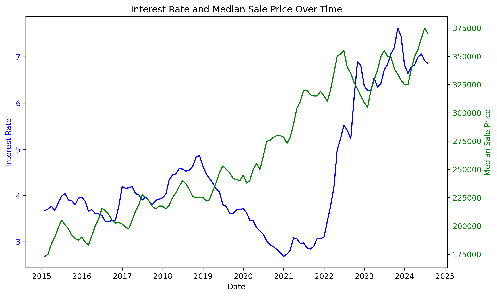

# Team-Project-1
# Housing Market Dynamics: Price Trends, Interest Rates, and Supply vs. Demand

## Questions:
1. How do changes in interest rates correlate with housing prices?
2. How have home prices evolved over time?
3. How do fluctuations in rent data relate to changes in sales count and median sale prices over time?

## Project Overview
This project analyzes various aspects of the U.S. housing market from 2015 to 2024, focusing on key metrics such as interest rates, rent prices, sales count, median sale price, and total transaction value. The analysis aims to reveal trends and correlations between these metrics, helping to understand how interest rates influence housing prices, sales volume, and rent prices over time.

The project leverages Python, using libraries such as Pandas for data manipulation and Matplotlib for data visualization.

---

## Data Files
The project uses the following CSV data files, sourced from Zillow and FRED, located in the Resources folder:
1. `MORTGAGE30US.csv`: Historical U.S. mortgage interest rates.
2. `Metro_zori_uc_sfrcondomfr_sm_month.csv`: Rent data for U.S. housing markets.
3. `Metro_total_transaction_value_uc_sfr_month.csv`: Total transaction value data for U.S. housing markets.
4. `Metro_sales_count_now_uc_sfrcondo_month.csv`: Sales count data for U.S. housing markets.
5. `Metro_median_sale_price_uc_sfr_month.csv`: Median sale price data for U.S. housing markets.
6. `Metro_market_temp_index_uc_sfrcondo_month.csv`: Market temperature index for U.S. housing markets.

---

## Key Functions & Workflow

1. **Data Import and Preparation**
   - The code imports multiple datasets using Pandas, focusing on U.S. data by filtering where `RegionName == 'United States'`.
   - Each dataset is cleaned, unnecessary columns are dropped, and the data is transposed for further analysis.

2. **Interest Rate Data Processing**
   - The interest rate data (`MORTGAGE30US.csv`) is filtered to focus on the time period from 2015 to 2024.
   - It is then converted into monthly data using `resample()` and cleaned for further analysis.

3. **Data Merging**
   - Various metrics (e.g., sales count, median sale price, transaction value, rent data) are merged by the `Date` column to facilitate correlation and trend analysis.

4. **Data Visualization**
   - The code generates multiple plots to visualize trends in the housing market over time. Each visualization is saved as a PNG image in the **Graphs** folder:
     - Rent Prices Over Time
     - Sales Count and Median Sale Price Over Time
     - Total Transaction Value and Sales Count
     - Interest Rates vs. Median Sale Price

5. **Correlation Analysis**
   - The code calculates the correlation between metrics such as interest rates, sales count, and median sale price. Insights include:
     - Moderate positive correlation between interest rates and median sale price.
     - Inverse correlation between lagged sales count and interest rates.

6. **Advanced Analysis**
   - The project includes advanced analysis such as lagged correlations to explore how past interest rates impact current sales and transaction values.

---

# Examples and Outputs

## Output
The code generates the following output:
1.	Graphs: Visualizations are saved in the Graphs folder:
	Rent Prices Over Time
	Total Transaction Value Over Time
	Sales Count and Median Sale Price Over Time
	Interest Rate vs. Median Sale Price
	Sales Count and Transaction Value Over Time
2.	Correlation Analysis: Printed correlation values between various metrics to understand their relationships.
 
## Examples
1. **Plot Interest Rate vs. Median Sale Price:**

   ```python
   # Merging interest rates with median sale price data
   merged_data_median_rate = pd.merge(filtered_interest_rate, us_median_sale_transposed, on='Date', how='inner')

   # Plotting the relationship
   fig, ax1 = plt.subplots(figsize=(10, 6))
   ax1.plot(merged_data_median_rate['Date'], merged_data_median_rate['Interest Rate'], color='blue', label='Interest Rate')
   ax2 = ax1.twinx()
   ax2.plot(merged_data_median_rate['Date'], merged_data_median_rate['Median Sale Price'], color='green', label='Median Sale Price')
   plt.title('Interest Rate and Median Sale Price Over Time')
   plt.show()
   ```

   Output: 

   >> **Conclusion**: Higher interest rates often correspond with lower home sales, while lower interest rates tend to push prices up, although this relationship is not perfectly linear.

---

2. **Plot Sales Count vs. Transaction Value:**

   ```python
   # Merging sales count and transaction value
   merged_data_count_tranval = pd.merge(us_total_trans_value_transposed, us_sales_count_transposed, on='Date', how='inner')

   # Plotting Sales Count and Transaction Value
   fig, ax1 = plt.subplots(figsize=(10, 6))
   ax1.plot(merged_data_count_tranval['Date'], merged_data_count_tranval['Sales Count'], color='blue')
   ax2 = ax1.twinx()
   ax2.plot(merged_data_count_tranval['Date'], merged_data_count_tranval['Transaction Value'], color='orange')
   plt.title('Sales Count and Transaction Value Over Time')
   plt.show()
   ```

   Output: 

   >> **Conclusion**: Higher sales counts usually align with higher transaction values, indicating a positive correlation between market activity and value.

---

3. **Plot Sales Count, Median Sale Price and Rent Data over time:**

   ```python
   # Plot Sales Count and Median Sale Price as line charts
   fig, ax1 = plt.subplots(figsize=(10, 6))
   ax1.plot(triple_merge['Date'], triple_merge['Sales Count'], color='blue', label='Sales Count')
   ax1.plot(triple_merge['Date'], triple_merge['Median Sale Price'], color='orange', label='Median Sale Price')
   ax1.set_xlabel('Date')
   ax1.set_ylabel('Sales Count / Median Sale Price', color='blue')
   ax1.tick_params(axis='y', labelcolor='blue')

   # Create a second axis for Rent Data as bars
   ax2 = ax1.twinx()
   ax2.bar(triple_merge['Date'], triple_merge['Rent Data'], color='green', alpha=0.2, width=10, label='Rent Data')
   ax2.set_ylabel('Rent Data', color='green')
   ax2.tick_params(axis='y', labelcolor='green')

   # Add a title
   plt.title('Sales Count, Median Sale Price (Line) and Rent Data (Bar) Over Time')

   # Add legends
   fig.legend(loc='upper left', bbox_to_anchor=(0.1, 0.9))
   plt.savefig('.\Graphs\TripleMergeOverT.png', dpi=300, bbox_inches='tight')
   plt.show()
   ```

   Output: 

   >> **Conclusion**: 
- Consistent upward trend suggests growing demand, potentially due to 
affordability challenges in homeownership. 

- Between 2022 and 2024, fewer people could afford to buy homes due to 
increased mortgage rates and median sale price, increasing rent prices. 

- Based on our findings, there is a loose positive correlation between median sale 
price and median rent.
